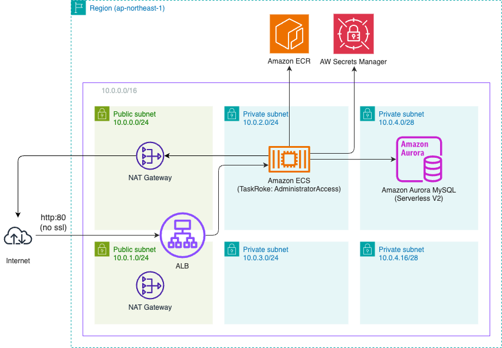

# CDK Web Application Stack Sample

## The construction this stack provisions

- The ALB can only be accessed via HTTP on port 80.
- The URL can be confirmed from the console after provisioning.
- The ALB performs a health check for the root path `/`. The application should return a response 200 for the root path.

## Deployment

### Prerequisites

- `AWS CLI V2` is installed.
- `node.js` and `npm` are installed.

### How to Deploy

1. Clone this repository.
2. Install the required packages with `npm i`.
3. Bootstrap CDK with `npm run cdk -- bootstrap`.
4. Deploy the stack with `npm run cdk -- deploy`.
5. After the ECR repository is created, push the Docker image.
   - You can see the build & push commands in the Amazon ECR console
6. Wait for the creation of resources to complete.
7. Once completed, you can connect to the application by accessing the URL displayed in `Output:`.

## Database

Database information will be set in the environment variables of the ECS container. The settings are as follows.

| Environment Variable | Value                                 |
| -------------------- | ------------------------------------- |
| DB_HOST              | DB host name                          |
| DB_PORT              | DB port (default: 3306)               |
| DB_NAME              | Default database name (default: mydb) |
| DB_USER              | Default user name                     |
| DB_PASS              | Auto-generated password               |
